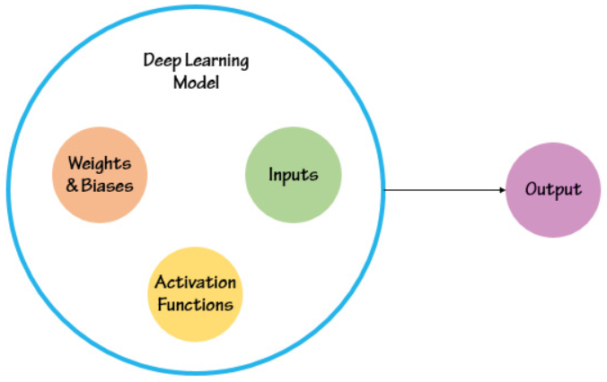
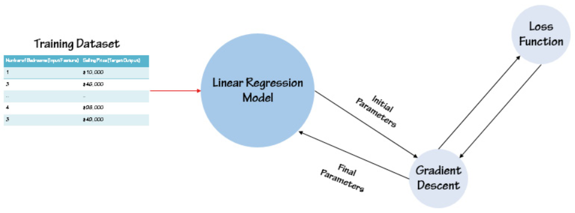

# Neural Networks

## Neural Network Architecture

Neural network architecture refers to the elements that are the building blocks of a neural network. While there are several different types of neural networks, the basic architecture and foundation remains constant. The architecture includes:

- Layers
- Nodes
- Edges
- Biases
- Activation Functions

#### Layers

Neural networks are made up of layers. While the number of these layers varies from model to model and is dependent on the task at hand, there are only three types of layers:

- Input layer
- Hidden layer
- Output layer

#### Nodes

Each activation node or neuron possess the following components:

- An activation: This is the current state of the node—whether it is active or not.
- A threshold value (optiona): If present, this determines whether a neuron is activated or not, depending on whether the weighted sum is above or below this threshold value.
- An activation function: This generates the output for the particular activation node based on the activation function.

#### Edges

A connection between two nodes is known as an edge. Each edge that leads to an activation node has its own weight, which can be considered as a sort of impact that one node has on the other node. Weights can be either positive or negative.

#### Biases

A bias is a node, and each layer of a neural network has its own bias node, except for the output layer. Thus, each layer has its own bias node. The bias node holds a value, known as the bias. This value is incorporated in the process of calculating the weighted sum and so also plays a role in determining the output generated by a node.

#### Activation Functions

Activation functions are functions that are part of the activation nodes found in the hidden layers of neural networks. They serve the purpose of introducing non-linearity into neural networks, which is really important, as without them neural networks would just have linear functions, leaving no difference between them and linear regression models.

Activation functions need to be differentiable for backpropagation to occur. 

Basically, an activation node calculates the weighted sum of the inputs it receives, adds the bias, and then applies an activation function to this value. This generates an output for that particular activation node which is then used as input by the proceeding layer. This output is known as an activation value.

## Training a Neural Network

There are three parts of the deep learning model that have an impact on the output generated by the model—the inputs, the connection weights and biases, and the activation functions.

While the inputs are taken from the dataset, the former two are not. Thus, the following two questions arise—who or what decides what the weight is for a connection? How do we know which activation functions to use?

#### Calculating weights

Calculating weights is done through the a process called backpropogation; the process of updating the weights using the <strong>gradient descent algorithm</strong> and the <strong>loss function</strong>.

## Designing a Neural Network

